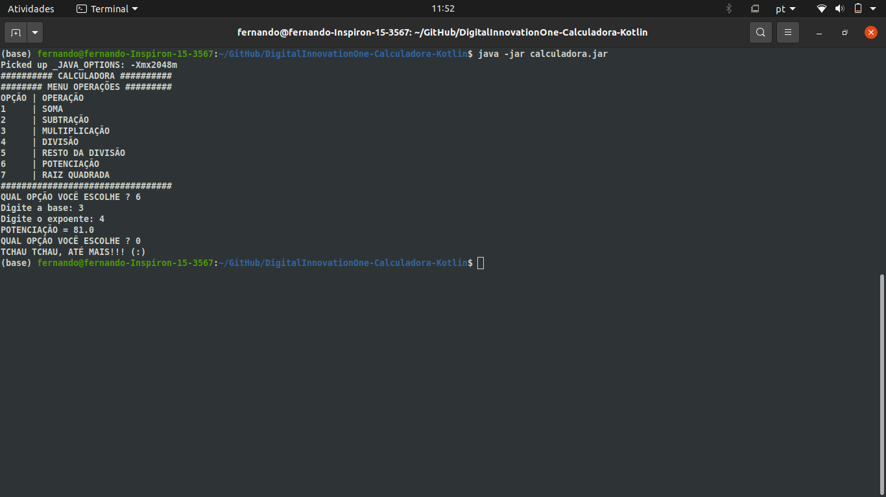

# Calculadora Kotlin (Digital Innovation One)
<hr>


<hr>

Essa é uma calculadora desenvolvida em koltin com as seguintes operações:
* Soma
* Subtração
* Multiplicação
* Divisão
* Resto da Divisão
* Potenciação
* Raiz Quadrada

### Executar Calculadora
<hr>

Esse programa pode ser executado pelo terminal do ubuntu usando o compilador Kotlin após o uso dos seguintes comandos:

```
koltinc calculadora.kt -include-runtime -d calculadora.jar
```
```
java -jar calculadora.jar
```

### Funcionamento
<hr>

Um menu como o mostrado na imagem aparecerá na sua tela, basta digitar o valor correspondente a operação que deseja fazer, depois, digite a quantidade de valores que entrarão na operação que você deseja fazer.
Digite cada valor seguindo da tecla **[ENTER]**

### Author

```
Fernando Santos De Freitas
```
